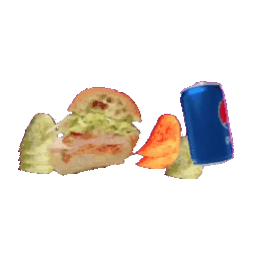
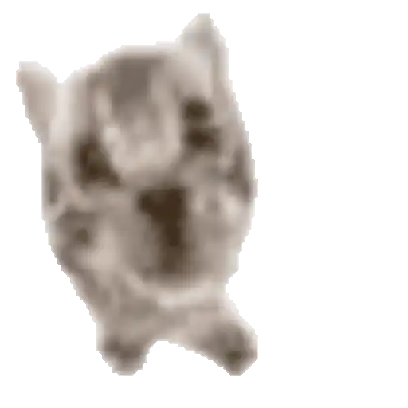
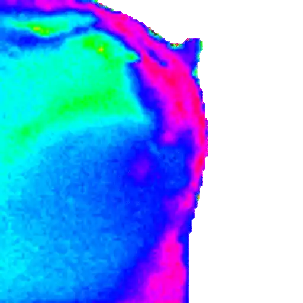
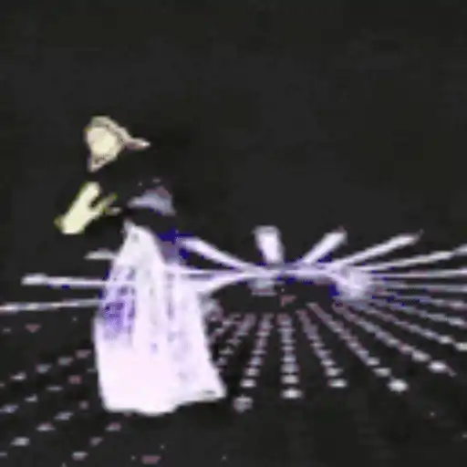
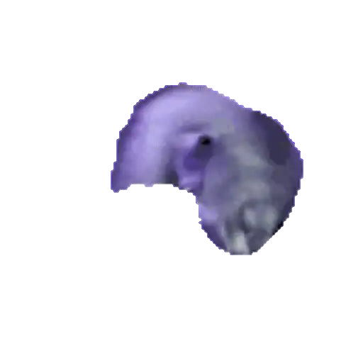
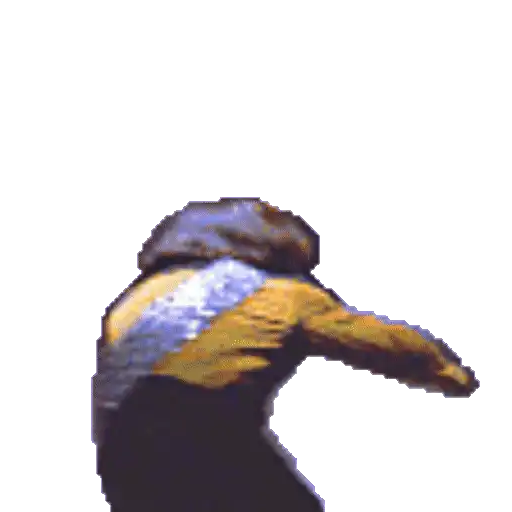

`Sticker Count: 228`

### Usage

To add these stickers on Signal, Viber or Telegram use [laggykiller's sticker-convert](https://github.com/laggykiller/sticker-convert).

To use these on iMessage or WhatsApp you'll need to import them into a sticker app.  
The sticker app ecosystem ***sucks***. [Sticker Maker Studio](https://getstickerpack.com/) is decent ([iOS](https://apps.apple.com/us/app/sticker-maker-studio/id1443326857)/[Android](https://play.google.com/store/apps/details?id=com.marsvard.stickermakerforwhatsapp)).  
**Avoid:** [BeSticky](https://apps.apple.com/us/app/sticker-maker-besticky/id1457046754), [WhatSticker](https://apps.apple.com/us/app/whatsticker-sticker-maker/id1147094379), [Sticker.ly](https://apps.apple.com/us/app/sticker-ly-sticker-maker/id1458740001) & [Top Sticker Maker](https://apps.apple.com/us/app/top-sticker-maker-wasticker/id938243056)

<!-- 
If you know a sticker app that:
- isn't riddled with ads
- supports common filetypes
- let's you reorder stickers
- handles transparency properly
- doesn't require you to pay for basic features
- supports both static & animated stickers in one pack
- optimizes media <500kb until it's >500kb instead of throwing an error

please let me know. I couldn't find one. 
-->

### Showcase

#### [baba](./wastickers/baba.wastickers)

|  |  |  |  |  |
|---|---|---|---|---|
|  |  |  |  |  |
|  |  |  |  |   |

#### [fingal](./wastickers/fingal.wastickers)

|  |  |  |  |  |
|---|---|---|---|---|

#### [food](./wastickers/food.wastickers)

|  |  |  |  |  |
|---|---|---|---|---|
|  |  |  |  |  |
|  |  |  |  |  |
|  |  |  |  |  |
|  |  |  |  |  |
|  |  |  |  |  |

#### [green guys](./wastickers/green%20guys.wastickers)

|  |  |  |  |  |
|---|---|---|---|---|
|  |  |  |  |  |
|  |  |  |  |  |
|  |  |  |  |  |
|  |  |  |  |  |
|  |  |  |  |  |

#### [jam](./wastickers/jam.wastickers)

| | | | | |
|---|---|---|---|---|
|  |  |  |  |  |
|  |  |  |  |  |
|  |  |  |  |  |
|  |  |  |  |  |
|  |  |  |  |  |
|  |  |  |  |  |

#### [lounging](./wastickers/lounging.wastickers)

|  |  |  |  |  |
|---|---|---|---|---|
|  |  |  |  |  |
|  |  |  |  |  |

#### [mugs & busts](./wastickers/mugs%20&%20busts.wastickers)

|  |  |  |  |  |
|---|---|---|---|---|
|  |  |  |  |  |
|  |  |  |  |  |
|  |  |  |  |  |
|  |  |  |  |  |
|  |  |  |  |  |

#### [osmo](./wastickers/osmo.wastickers)

|  |  |  |  |  |
|---|---|---|---|---|
|  |  |  |  |  |
|  |  |  |  |  |
|  |  |  |  |  |
|  |  |  |  |  |
|  |  |  |  |  |

#### [sphynx](./wastickers/sphynx.wastickers)

|  |  |  |  |  |
|---|---|---|---|---|
|  |  |  |  |  |
|  |  |  |  |  |
|  |  |  |  |  |
|  |  |  |  |  |
|  |  |  |  |  |

#### [trek](./wastickers/trek.wastickers)

|  |  |  |  |  |
|---|---|---|---|---|
|  |  |  |  |  |
|  |  |  |  |  |
|  |  |  |  |  |
|  |  |  |  |  |
|  |  |  |  |  |
